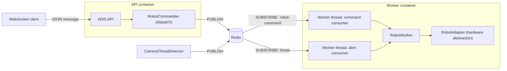

# RobotCommander (Raspberry Pi)

Robot control service intended to run **only on a Raspberry Pi** connected to a **Sunfounder PiCrawler AI** robot.

## What it does

- **API container (WebSocket)**: exposes `/v1/ws/publish` to receive commands over WebSocket.
- **Worker container**: runs a `RobotRoutine` loop that listens to Redis and triggers routines.
- **Robot adapter**: `RobotAdapter` is currently a stub implementation (logs actions only).

## Architecture and flow



## Requirements

- Docker (recommended on the Raspberry Pi)
- A Redis instance reachable from the Raspberry Pi (defaults to `localhost:6379` for the worker)

## Run with Docker (recommended)

```bash
make run
```

This command builds both images, starts both containers, and streams logs to the current terminal session.

### Useful Make targets

```bash
make build        # Build both images
make up           # Start both containers and follow logs
make logs         # Follow logs for both containers
make down         # Stop and remove both containers
make clean        # Remove containers and images
```

## Run locally (no Docker)

```bash
python -m pip install -r requirements.txt
python -m src.main
```

## WebSocket API

- **Endpoint**: `ws://<host>:8000/v1/ws/publish`
- **Payload**: JSON text frames with an explicit `channel`:
  - `{"channel":"robot-command","command":"stop"}`
  - `{"channel":"threat","command":"knife"}`

Supported commands (current implementation):
- `knife` / `gun`: triggers the routine in the worker
- `stop`: triggers a stop in the worker (stub)

## Send test commands

### Option A: bundled test script

Install the client dependency:

```bash
python -m pip install websockets
```

Run the test publisher (publishes every 10 seconds by default):

```bash
python -m src.tests.websocket_publish_test --host 127.0.0.1 --port 8000 --mode command --commands "stop" --interval 10
```

Examples (explicit channels):

```bash
python -m src.tests.websocket_publish_test --mode command --command-channel robot-command --alert-channel threat --commands "stop"
python -m src.tests.websocket_publish_test --mode alert --command-channel robot-command --alert-channel threat --commands "knife,gun"
python -m src.tests.websocket_publish_test --mode movement --command-channel robot-command --alert-channel threat --commands "forward,left,right,stop"
```

### Option B: manual Redis publish (worker channel)

To bypass the API and trigger the worker directly, publish to Redis.
The worker listens on the `threat` channel by default:

```bash
python -c "import redis; redis.Redis(decode_responses=True).publish('threat','knife')"
```

